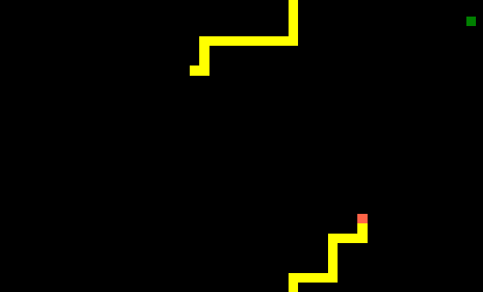

# snake-js
A simple snake game.

## Table of contents
* [General info](#general-info)
* [Technologies](#technologies)
* [Screenshots](#screenshots)

## General info
Gra napisana w "czystym" JavaScript. W nowej wersji przerobiłem całkowicie kod, by przejść z programowania funkcyjnego na zorientowane obiektowo.
Zapisuję lokalizacje każego ruchu i na podstawię danych generuję Snake za pomocą elementów blokowych.

A simple Snake game works on the basis of create block
element and saved location in array. 
Updates the chain and check collision with every move.
Project made as part of my JavaScript learning.

## Technologies
JavaScript

## Screenshots

