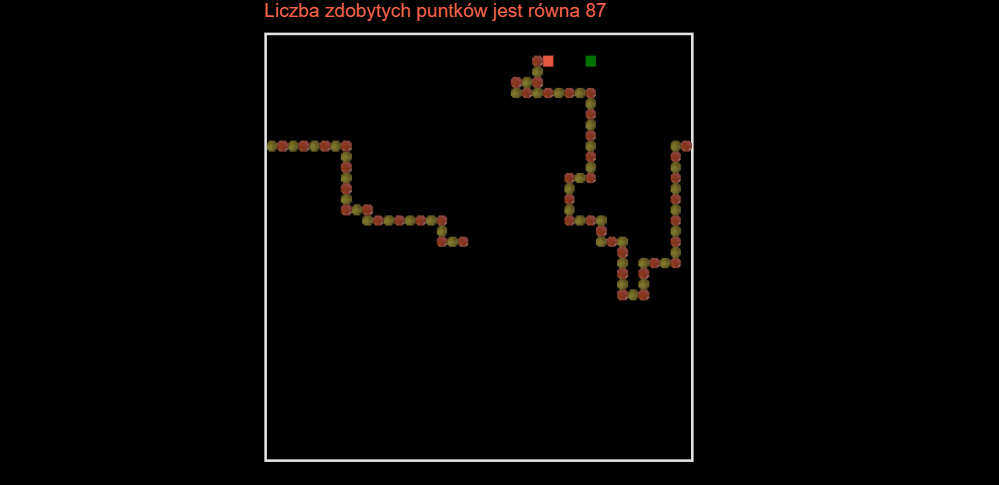

# snake-js
Snake game.

## Table of contents
* [General info](#general-info)
* [Technologies](#technologies)
* [Screenshots](#screenshots)

## General info
[PL]
Mobile and desktop version of game Snake.
Gra zapisana w czystym JavaScript. Początkowo napisana funkcyjnie potem całkowicie kod przepisany za pomocą programowania zorientowanego obiektowo.
Gra zapisuję lokalizacje każdego ruchu gracza i na podstawie danych generuję pozycję łańcucha Snake. Przed generowaniem elementów sprawdzana jest ewentualna kolizycjność ruchu - jeśli występuję następuję wygenerownie nowej pozycji. W aktualnej wersji dodałem supermoce (prędkość, spowolnienie). Gracz ma 10 sekund za zdobycie efektu, który trwa 20 sekund. 

## Technologies
JavaScript

## Demo 
https://jakubjereczek.github.io/js-snake/

## Screenshots

### Latest version 

